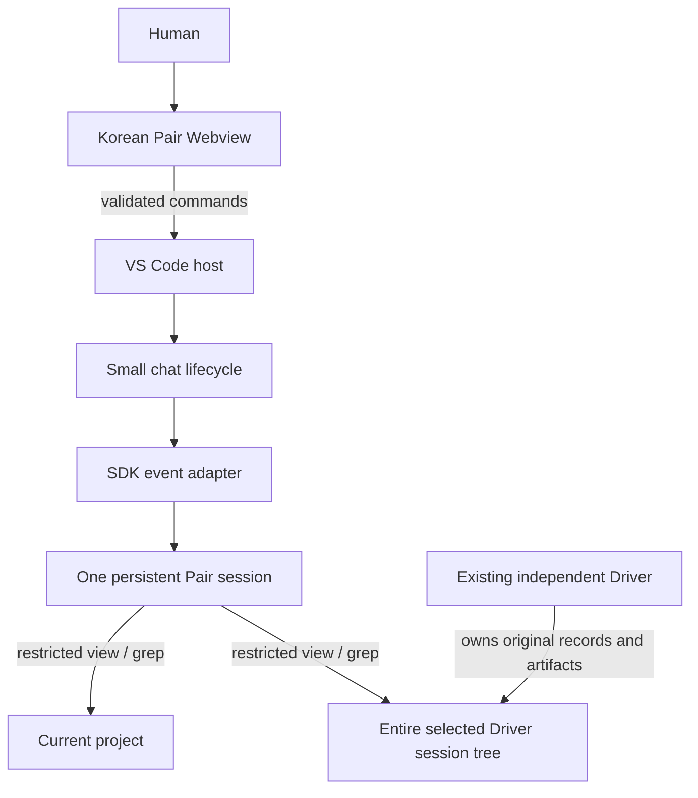

# Implementation and Code Reading Guide

**Updated:** September 16, 2026

**Scope:** Current Wellactually VS Code extension

**Contract:** [Current product design](specs/2026-09-12-wellactually-product-design.md)

This guide maps the Korean-only, user-triggered Pair implementation. The
conversational role is Pair / **페어**; internal `coach` filenames, symbols and
VS Code IDs retain their spelling for compatibility.

## 1. Current implementation

The prototype has no report framework, Driver event normalizer,
file watcher, automatic scheduler, evidence journal, review-context graph,
language selector or recovery store. The remaining boundaries support a real
chat UI, restricted SDK reads and reliable cancellation.

Do not shrink code by deleting read permissions, IME behavior or owned-resource
cleanup. Those are small but important correctness responsibilities.

## 2. Architecture

There is no log-to-Pair trigger and no Wellactually-to-Driver command path.
The Pair runs only when the human submits a message.

### Who owns which state?

| State | Owner | Reason |
| --- | --- | --- |
| Model conversation and compaction | SDK session | Preserve reasoning context without replaying the entire transcript. |
| Original messages, read excerpts, active request | Host chat | Display data and manage stop/end. This is not semantic memory. |
| Draft, transient reply, focus and scroll | Webview | Maintain a usable interface as asynchronous events arrive. |
| Complete project and selected Driver session trees | Host/runtime policy | Restrict reads to two roots without filename exclusions. |

## 3. Trace one conversation

### Open and first message

1. The manifest loads the CommonJS [activation shim](../code/src/extension.cts),
   which imports the ESM [host](../code/src/extension-main.ts).
2. The host registers the view and **Wellactually: 페어 열기** command.
3. The [provider](../code/src/ui/coachView.ts) supplies HTML/local assets and
   waits for the browser's `ready` message.
4. The opening view shows an AI pair-programming title, product description and
   read-only project-sharing disclosure. The user can immediately type;
   opening the view does not start a model.
5. The first `message` is parsed at the browser/host boundary, checked against
   the current chat ID, and passed to [chat](../code/src/pairing/chat.ts).
6. A single open project is used automatically. A multi-root window uses the
   active editor's project or asks only when ambiguous.
7. The runtime tries ambient/environment auth in its private data directory.
   If absent, the host tries the public VS Code GitHub provider silently before
   requesting interactive access.
8. The same Pair session is reused for future messages. Every request asks
   for Korean, preserving source quotes and code.

The host remembers the project for the conversation. Merely focusing another
editor does not silently change read access.

### Driver connection and direct reads

The native picker includes ordinary Copilot Chat indexes across saved workspace
storage and empty windows, plus registered agent-host sessions and the
default/configured Copilot stores.
[chatCatalog.ts](../code/src/driver/chatCatalog.ts) reads workspace Chat titles
and timings from the history indexes, resolves exact transcript/artifact paths,
and validates selection identity with a streaming parser rather than retaining
a conversation tree. [vscodeCatalog.ts](../code/src/driver/vscodeCatalog.ts) reads the
profile registry and per-session `customTitle`/backing metadata via the macOS
read-only SQLite utility. [catalog.ts](../code/src/driver/catalog.ts) deduplicates
backing entries, prioritizes real titles over SDK first-message names, and sorts
globally by activity with no project bias. Missing records stay visible.
[source.ts](../code/src/driver/source.ts) reads bounded YAML metadata and
revalidates the selected source identity and first
`session.start` record. There is no subsequent host ingestion, log copy or
event classification.

The runtime grants the complete project tree and selected session's records.
SDK sessions authorize their dedicated tree; ordinary Chat authorizes its exact
transcript file and session-specific editing tree, not shared parent directories.
Symlinks resolve within
their union; outside targets remain denied. Native search handles traversal
without following external directory links, and the host bounds output rather
than enumerating every project file. Explicit reads remain available for Git
metadata omitted by recursive search.

A new connection revokes the old session's extra scope without restarting the
Pair. Project files remain readable independently. Each user request refreshes
both authorized roots in model context, and missing Driver selection does not
prevent project reads or conceptual advice.

The model chooses what is relevant. The host chooses what paths and tools are
permitted. Native `view`/`grep` still perform the actual content reading/search.
Reading a Driver claim of success is not independent execution verification.

### Streaming, stop and end

The SDK pushes events. The adapter converts them to an async iterator of text,
tool activity and bounded read excerpts. It avoids displaying both streamed
text and the SDK's repeated final message.
Every search excerpt is labeled with its actual search operands rather than
assuming the project root. A closed runtime makes its chat terminal; successful
client shutdown is remembered so fresh-chat cleanup does not call a stopped RPC.

The host accepts one request at a time. Stop aborts it and awaits idle; an abort
acknowledgement alone does not prove model/tool work has settled. End prevents
new sends immediately, then stops and closes owned resources. New chat clears
the in-memory display transcript and Driver selection.

There is no post-end model call, snapshot, report validation/render/export or
restart recovery. User-owned logs and reports exported by old versions are not
deleted.

## 4. Source reading map

### Entry and chat

| File | Responsibility |
| --- | --- |
| [extension.cts](../code/src/extension.cts) | CommonJS-to-ESM loading compatibility, not business logic. |
| [extension-main.ts](../code/src/extension-main.ts) | VS Code project/auth dialogs, composition, command routing, Driver selection and shutdown. |
| [contracts.ts](../code/src/contracts.ts) | Driver, message, chat, model selection/capability and runtime types; no report or language types. |
| [pairing/chat.ts](../code/src/pairing/chat.ts) | Lazy runtime, Korean prompt, one active send, transcript, stop/end and serialized Driver/model changes. |
| [driver/source.ts](../code/src/driver/source.ts) | Whole-store Copilot session metadata discovery, ordering, readiness/errors and selected identity/header validation. No log collection or watcher. |
| [driver/vscodeCatalog.ts](../code/src/driver/vscodeCatalog.ts) | Read-only metadata queries for the current VS Code profile's registry, titles and visible-to-SDK identity mapping. |
| [driver/catalog.ts](../code/src/driver/catalog.ts) | Merged global catalog, title-first picker items, source availability and selection revalidation. |
| [driver/chatCatalog.ts](../code/src/driver/chatCatalog.ts) | Ordinary Chat discovery across workspace/global indexes and exact JSON/JSONL record selection with bounded streaming identity validation. |
| [driver/selection.ts](../code/src/driver/selection.ts) | Selection busy state shared by the host's connection guards and the displayed Driver controls. |
| [validation.ts](../code/src/validation.ts) | Object and bounded text guards used at real input boundaries. |
| [format.ts](../code/src/format.ts) | One-pass placeholder replacement without reinterpreting inserted source text. |
| [hostMessages.ts](../code/src/hostMessages.ts) | Fixed Korean host notifications and dialog text. |

### SDK

| File | Responsibility |
| --- | --- |
| [sdkRuntime.ts](../code/src/runtime/sdkRuntime.ts) | Owned client directories, best-effort authentication, timeout/cleanup helpers, restricted session configuration and tool inventory check. |
| [coachRuntime.ts](../code/src/runtime/coachRuntime.ts) | Push-event to async-stream adaptation, read excerpts, completion, cancellation and same-session permission changes. |
| [models.ts](../code/src/runtime/models.ts) | SDK-derived model options, supported effort validation, workspace-preference parsing and target-model defaults. |
| [readPolicy.ts](../code/src/runtime/readPolicy.ts) | Two-root read authorization, canonical link boundaries, directory/file operands and bounded tool arguments/results. No filename exclusions. |
| [coach.md](../code/src/policies/coach.md) | One-contribution discussion turns, tentative concerns, human-response continuity and Human/Driver role boundaries. |
| [coach-tone.md](../code/src/policies/coach-tone.md) | Natural Korean peer-to-peer contributions rather than miniature reports; no explanation-first or mandatory-question template. |
| [coach-tools.md](../code/src/policies/coach-tools.md) | No evidence audit for every hunch; relevant reads for discussion/verification, source scope and distrust of source instructions. |
| [driver.agent.md](../code/src/agents/driver.agent.md) | Optional Driver persona; the extension does not create or control a Driver. |

The runtime enables Infinite Sessions compaction but disables separate Memory
and cross-session retrieval. The three policy assets replace only SDK
`identity`, `tone` and `tool_efficiency` through `customize`; SDK safety and
tool-instruction sections remain intact. Prompt text is not a permission
mechanism, and existing conversations do not reload changed policies.
Model/effort changes are separate from persona changes: an idle runtime switches
through the SDK while retaining the session, then confirms model state and the
read-only tool inventory. A failed confirmation closes the runtime rather than
leaving the selected label out of sync. UI choices are stored in workspace state.
Working-directory configuration is not an OS
sandbox. Private `COPILOT_HOME` does not guarantee default CLI account reuse;
the public VS Code auth fallback is the supported host reuse path.

### UI

| File | Responsibility |
| --- | --- |
| [coachView.ts](../code/src/ui/coachView.ts) | Webview lifecycle, local resource roots, one command parse and ready handshake. |
| [messages.ts](../code/src/ui/messages.ts) | Allowed user actions and state/events. Removed language/report commands are rejected. |
| [webview.ts](../code/src/ui/webview.ts) | Fixed Korean HTML shell, nonce/CSP, transcript, composer and project/Driver settings. |
| [webview-client.ts](../code/src/ui/webview-client.ts) | Browser rendering, request/draft bookkeeping, scroll, dialog focus, stop/end/new chat. |
| [chatMessage.ts](../code/src/ui/chatMessage.ts) | Limited safe formatting and Enter/Shift+Enter/IME behavior. |
| [strings.ts](../code/src/ui/strings.ts) | Single Korean catalog, no locale resolver. |
| [styles.css](../code/src/ui/styles.css) | Native themed chat layout, pinned composer, scrolling, focus and narrow sidebar handling. |

The UI has its own transient state because it must preserve drafts and scroll
position. This is not another model memory or an evidence ledger. UI command
IDs and stream IDs distinguish browser requests from streamed responses.

## 5. Launch and package configuration

[launch.json](../.vscode/launch.json) is a developer convenience, not production
infrastructure. It opens an Extension Development Host, loads the extension
from the repository's application directory, and runs the build task first.

| Field | Meaning |
| --- | --- |
| `type: extensionHost` | Debug the extension inside VS Code. |
| `request: launch` | Start a new debug host instead of attaching. |
| `--extensionDevelopmentPath` | Tell the host where this extension lives. |
| `outFiles` | Find emitted JavaScript for source-map debugging, not packaging. |
| `preLaunchTask` | Compile using the matching task label. |

The launch configuration uses the build task in
[tasks.json](../.vscode/tasks.json).
The `.js` output glob does not include the tiny `.cjs` shim; add that extension
only if stepping through the shim is needed.

- [package.json](../code/package.json): contributions, model setting, engines,
  pinned SDK and build/test/package commands. No language setting.
- [package.nls.json](../code/package.nls.json): default Korean native captions
  regardless of the editor locale. No second language catalog is needed.
- [package-lock.json](../code/package-lock.json): dependency reproducibility,
  not product logic.
- [tsconfig.json](../code/tsconfig.json): strict NodeNext TypeScript/source maps.
- [.vscodeignore](../code/.vscodeignore): excludes tests and local artifacts.
- [coach.svg](../code/media/coach.svg): sidebar icon.

The build removes old generated output before compiling; verify removed
Compiler/language modules do not linger in a packaged VSIX. Native SDK assets
dominate VSIX size, so source deletion does not proportionally shrink it.

## 6. What to test and what remains unknown

Core regression coverage includes first-message startup, persistent reuse,
fixed Korean prompts, cancellation during startup, partial replies, no automatic
reaction, session discovery, two-root permissions, path revocation, safe formatting and IME.
Manifest tests check the absence of a language preference and removed assets.

The [native SDK test](../code/test/sdkPaths.integration.ts) uses synthetic
large-log reads/searches and grants/revokes permissions on the same session.
The [Extension Host test](../code/test/extensionHost.integration.ts) separately
checks activation and Webview ready with Korean-only host state.

Direct tool tests do not prove model retrieval strategy, compaction recall,
auth reuse in every environment or learning. Those need an authorized normal
VS Code journey with synthetic demo data. See the
[demo checklist](../deploy/demo-checklist.md).

## 7. Reading order and maintenance boundaries

Read shared contracts, host wiring, chat lifecycle, SDK adapter, read policy
and browser behavior in that order. Explanatory source comments focus on
ownership, cancellation, scope and asynchronous boundaries rather than
describing every obvious statement.

The SDK adapter groups events in `handleSessionEvent`, captures read
excerpts in `captureReadExcerpt`, and names stream/turn state explicitly.
The host routes commands to named project, Driver and conversation functions.
Chat stop/end operations expose each cleanup step.

Keep the small runtime test seam, actual permission checks, UTF-8 limits,
stream cancellation and usable chat controls. No further large rewrite is
justified merely by file count. Avoid restoring a generic task runner,
report workflow, language framework or automatic observer.

The remaining product advances an agentic coding experience through the
human's reasoning and requested Driver-result reviews (Inspiration/Customer
Focus), useful delegation support (Business Value), SDK reuse (Feasibility),
and a working installed Pair (Make Something). The Seoul demo deadline is
September 18 at 09:00; the global video deadline remains September 21 at
11:59 PM Pacific.
