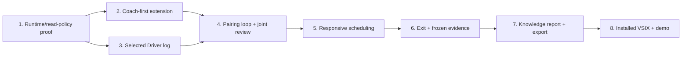

# Wellactually File-Based MVP Implementation Plan

> **For agentic workers:** Implement this plan task-by-task in the current session using the `tdd` skill. Steps use checkbox (`- [ ]`) syntax for tracking.

**Goal:** Deliver an optional, responsive AI pairing session on an existing project: Coach-first discussion, a human-authored Driver instruction, joint review of the Driver's results, and an evidence-backed HTML knowledge report.

**Architecture:** Keep the existing Driver UI and runtime. A separate Copilot SDK Coach uses verified read/search tools, while a small host-side JSONL helper connects one selected Driver log to the pairing session. The extension owns lifecycle, scheduling, evidence, and export; the Knowledge Compiler receives a frozen snapshot, not live workspace access.

**Tech Stack:** TypeScript, VS Code Desktop extension/WebviewView, GitHub Copilot SDK, Node.js filesystem APIs, and local JSON/JSONL state. Use TypeScript compilation and the built-in `node:test` runner; do not introduce a web framework, database, cloud service, AHP client, or general-purpose workspace reader for the MVP.

## Global Constraints

- Application source and tests belong in `code/`. This plan belongs directly in `docs/` as requested.
- Repository documentation and documentation comments are English. User-facing Coach conversation may follow the user's language.
- The initial environment is one trusted local workspace and one explicitly selected Driver session with the verified CLI/SDK log format. Other native harnesses, remote workspaces, and multiple Drivers require separate verification.
- Preserve the existing Driver UI. Only the human sends Driver instructions or approves its operations.
- Coach-first discussion must work before a Driver log is selected.
- One discussion iteration ends when a new human-authored Driver instruction is confirmed. That is not the end of the pairing session.
- The human and Coach review the same retained Driver evidence. Further discussion may start another iteration.
- Coach may read/search saved workspace files with existing SDK tools. No editing, shell execution, delegation, or Driver-control tools.
- A working directory is not a sandbox. Verify the actual tools and permission behavior before claiming read-only operation.
- Do not expose arbitrary session directories, credentials, system instructions, or raw logs wholesale to the model.
- Compiler input is immutable at the pairing cutoff. Compiler has no live workspace/log access and cannot write HTML or choose a file path.
- Pairing exit must not stop the Driver. Report generation or export failure must not prevent exit or ordinary development.
- No voice, unsent Driver-draft interception, Coach-written tests, automatic instruction forwarding, or always-on coaching in the MVP.
- `v1.0.13` / commit `f13e4a2` is the SDK source baseline in the design, not a statement that it is the latest version or already verified in the target extension host.
- Pin installed versions and commit the lockfile during implementation only when a commit is requested. Never commit authentication material or private session fixtures.
- Do not implement this plan, install packages, create an extension, or make a commit merely as a consequence of writing this document.

---

## 1. Basis and Current State

Read before implementing:

- [Repository workflow](../AGENTS.md), [project README](../README.md), and [canonical context](../CONTEXT.md).
- [Event requirements](./hackathon-2026.md).
- [Canonical English product contract](./specs/2026-09-12-wellactually-product-design.md).
- [Latest technical design](./ideation/technical-design.md) and [product description](./ideation/product-description.html).
- [Application layout](../code/README.md).

The canonical English product contract and README/CONTEXT reflect the accepted file-based MVP decisions. The technical design elaborates those boundaries and this plan divides implementation into locally verified slices. GitHub issues are tracking units; implementation runs locally with GitHub Copilot, not by assuming a cloud agent has access to the user's IDE, credentials, or session logs. There are currently no application sources, package manifest, build scripts, or tests.

### Evidence already obtained: do not call it a complete integration test

| Observation | Verified scope | Not established |
|---|---|---|
| Approximately 19.7 MB / 2,720 JSONL records were readable | This conversation's Copilot CLI/SDK session | Every Copilot harness uses that location or format |
| User messages, assistant messages, tool arguments and results were present | Metadata/structure inspected without publishing raw content | All tool output and transient execution state are retained |
| A unique stdout marker appeared in a correlated completion event | One run, approximately 249 ms after emission, with 100 ms polling | A latency guarantee or model response-time measurement |
| The result could be reopened after the watcher stopped | Disk persistence in that run | Rotation, restart recovery, or the future Coach read-only profile |

Keep this result as the baseline. Repeat only the scoped fixture probe needed to establish the exact runtime used by the demo. Do not inspect unrelated real sessions.

### Dependency map



Tasks 2 and 3 can proceed independently after Task 1. Do not parallelize edits to shared contracts or the extension entry point. Each task ends at a review gate; passing unit tests does not substitute for that task's live gate.

## 2. Delivery Slices and Stop Conditions

| Task | Independently demonstrable result | Gate | If it fails |
|---|---|---|---|
| 1 | A real SDK Coach can read/search allowed fixture code but cannot mutate it | Actual runtime/tool/permission evidence | Stop integration; do not enable broad tools or build a reader framework |
| 2 | A user starts Coach without Driver and receives streamed replies | Extension Development Host smoke test | Fix startup, credentials, UI, or streaming before adding automation |
| 3 | A selected log yields past context and new correlated results | Fixture replay plus a controlled live marker | Narrow supported format; never silently select a different log |
| 4 | A direct Driver instruction closes one iteration; its result is jointly reviewed | One complete discussion/execution/review loop | Do not infer human origin or iteration ownership from ambiguous events |
| 5 | Direct conversation is prioritized and measurable | Deterministic scheduler tests plus real latency measurements | Optimize measured bottlenecks; do not conceal slow calls behind status text |
| 6 | Exit freezes evidence and cleans up Coach/watchers without stopping Driver | Race/restart tests and a live exit-during-Driver-run test | Show cleanup failure; reject stale callbacks and new automation |
| 7 | A validated, portable HTML report can be saved | Evidence validation, isolation, hostile-content, and export tests | Keep failure separate from session exit; retain a retryable frozen input |
| 8 | A clean VSIX installation runs the full flow | Clean-profile rehearsal with disclosed limitations | Freeze scope; fix the broken slice instead of adding features |

### Working dates, not effort estimates

- **September 14:** Task 1; begin Tasks 2 and 3 only after their prerequisite gate.
- **September 15-16:** Tasks 2-4, with a full live pairing loop by the end of September 16.
- **September 17:** Tasks 5-8, code freeze, installed-package rehearsal, and a fallback recording.
- **September 18, before 09:00 Seoul:** working demo ready for the 09:00-12:00 first-round review.
- **September 21, 11:59 PM Pacific Time:** separate global submission deadline; Project Video is at most two minutes.

These are checkpoints, not permission to skip gates. Cut rich formatting, automatic prompts, or broad environment support before cutting human control, usable conversation, joint review, or report integrity.

## 3. File Map and Validation Convention

Create only the files a slice uses. Keep helpers within their feature until a second real consumer needs them.

```text
code/
  package.json / package-lock.json / tsconfig.json
  README.md
  .vscodeignore
  src/
    extension.cts                 # CommonJS entry -> compiled TS implementation
    extension-main.ts             # VS Code registrations and dependency composition
    contracts.ts                  # shared DTOs only
    runtime/
      readProfile.ts              # verified version/tool/path policy
      coachRuntime.ts             # owned SDK session, streaming and cleanup
      metrics.ts                  # content-free timing events
    pairing/
      controller.ts              # pairing lifecycle and iteration ownership
      journal.ts                 # selected evidence, immutable freeze
      scheduler.ts               # one request, priorities, batching and leases
      store.ts                   # atomic per-session state and recovery
    driver/
      localLog.ts                # file identity, complete-line cursor, watcher
      normalize.ts               # whitelist event projection and correlation
    compilation/
      compiler.ts                # fresh isolated SDK job
      validate.ts                # report schema and evidence checks
      render.ts                  # fixed script-free HTML
      export.ts                  # user-selected destination, retryable save
    ui/
      messages.ts                # pure UI-command parsing, no VS Code runtime import
      coachView.ts               # message validation and view provider
      webview.ts                 # client-side DOM/event handling
      styles.css
    agents/
      driver.agent.md
    policies/
      coach.md
      compiler.md
    scripts/
      probeReadProfile.ts
      probeDriverLog.ts
      probeCompiler.ts
      measureLatency.ts
  test/
    readProfile.test.ts
    coachView.test.ts
    localLog.test.ts
    pairingLoop.test.ts
    scheduler.test.ts
    exitSnapshot.test.ts
    compilation.test.ts
    installedAssets.test.ts
    fixtures/
      workspace/catalog.ts
      workspace/README.md
      driver-session.jsonl
deploy/
  demo-checklist.md
.vscode/
  tasks.json / launch.json
```

### Build/test convention introduced by Task 1

No runner exists today. Use the built-in Node test runner rather than adding a testing framework. All subsequent commands run from `code/`.

```json
{
  "name": "wellactually",
  "version": "0.0.1",
  "private": true,
  "type": "module",
  "scripts": {
    "build": "tsc -p tsconfig.json",
    "test": "npm run build && node --test dist/test/*.test.js",
    "probe:read": "npm run build && node dist/src/scripts/probeReadProfile.js",
    "probe:log": "npm run build && node dist/src/scripts/probeDriverLog.js",
    "measure:latency": "npm run build && node dist/src/scripts/measureLatency.js"
  }
}
```

```json
{
  "compilerOptions": {
    "target": "ES2022",
    "module": "NodeNext",
    "moduleResolution": "NodeNext",
    "rootDir": ".",
    "outDir": "dist",
    "strict": true,
    "noUncheckedIndexedAccess": true,
    "exactOptionalPropertyTypes": true,
    "esModuleInterop": true,
    "skipLibCheck": true,
    "lib": ["ES2022", "DOM"],
    "types": ["node", "vscode"]
  },
  "include": ["src/**/*.ts", "src/**/*.cts", "test/**/*.ts"]
}
```

During implementation, install only after adding the manifest:

```bash
npm install --save-exact @github/copilot-sdk@1.0.13
npm install --save-dev --save-exact typescript @types/node @types/vscode
```

Task 1 must inspect SDK `engines` and the selected VS Code Extension Host's Node version before choosing a supported runtime. Record exact versions and keep the generated lockfile. If the pinned SDK cannot run, stop and explicitly choose a replacement version after reviewing its API; do not quietly use a different API under the old version label.

Use `code --version`, `node --version`, and `npm view @github/copilot-sdk@1.0.13 engines --json` to establish the initial matrix. In the Extension Development Host, report `process.version` from the host implementation and compare it again; the terminal's Node version is not proof of Extension Host compatibility.

`dist/`, generated VSIX files, probe results, runtime credentials, private logs, and reports are not source. Inspect the existing `.gitignore` before appending specific entries; preserve its unrelated changes.

For a red/green cycle, a missing export compile error is a valid initial red. A missing dependency is not evidence of the expected red; resolve installation first. Use the smallest listed selector, then run the full existing test command at integration gates.

### Stable internal contracts

Create these in `code/src/contracts.ts` as their first consumers are implemented. Preserve the technical design's field names instead of inventing competing DTOs. These interfaces are application contracts, not SDK-native payloads.

```ts
export type PairingStatus =
  | "active" | "paused" | "closing" | "closed" | "close_failed";
export type IterationStage =
  | "discussing" | "driver_pending" | "reviewing";

export interface DriverBinding {
  bindingId: string;
  generation: number;
  workspaceUri: string;
  logFileUri: string;
  sdkSessionId: string;
  format: "copilot-sdk-events-jsonl";
}

export interface PairingSession {
  pairingId: string;
  status: PairingStatus;
  stage: IterationStage;
  iteration: number;
  epoch: number;
  revision: number;
  driver: DriverBinding | null;
}

export interface ReplyLease {
  pairingId: string;
  epoch: number;
  revision: number;
  snapshotId: string;
}

export interface Evidence {
  id: string;
  source: "human" | "coach" | "driver" | "tool" | "file";
  sourceRef: string;
  sourceVersion: string;
  recordedAt: string;
  completeness: "complete" | "partial" | "in_progress";
  text: string;
}

export interface Decision {
  id: string;
  status: "proposed" | "human_confirmed" | "revised";
  choice: string;
  reason: string;
  evidenceIds: readonly string[];
}

export interface EvidenceSnapshot {
  readonly snapshotId: string;
  readonly pairingId: string;
  readonly revision: number;
  readonly cutoff: number;
  readonly sha256: string;
  readonly coverage: {
    readonly driver: "unbound" | "current" | "partial";
    readonly gaps: readonly string[];
  };
  readonly evidence: readonly Readonly<Evidence>[];
  readonly decisions: readonly Readonly<Decision>[];
}

export type KnowledgeBasis =
  | "discussed" | "human_explained" | "execution_observed" | "unverified";

export interface KnowledgeItem {
  title: string;
  before: string;
  after: string;
  why: string;
  appliesWhen: string;
  limits: readonly string[];
  basis: KnowledgeBasis;
  evidenceIds: readonly string[];
}

export interface KnowledgeReport {
  schemaVersion: 1;
  pairingId: string;
  snapshotId: string;
  title: string;
  items: readonly KnowledgeItem[];
  openQuestions: readonly string[];
}

export interface NormalizedEvent {
  id: string;
  bindingId: string;
  generation: number;
  kind: "human_submission" | "assistant_output" | "tool_result";
  text: string;
  completeness: "complete" | "partial" | "in_progress";
  toolCallId?: string;
  turnId?: string;
  origin: "confirmed_user" | "unknown";
  historical: boolean;
}

export type CoachDelta =
  | { kind: "text"; text: string }
  | { kind: "tool"; name: string; state: "started" | "completed" }
  | { kind: "evidence"; toolCallId: string; evidence: Evidence };

export interface CoachRuntime {
  sessionId: string;
  stream(
    prompt: string,
    lease: ReplyLease,
    signal: AbortSignal
  ): AsyncIterable<CoachDelta>;
  cancelAndSettle(deadlineMs: number): Promise<void>;
  close(): Promise<void>;
}

export interface PendingDirective {
  eventId: string;
  bindingId: string;
  generation: number;
  iteration: number;
}
```

Every decoded JSON/UI/SDK boundary begins as `unknown`. Validate it before constructing these DTOs. A regex matching `builtin:...` does not prove a tool is read-only. `readonly` in a type does not freeze a live object.

---

## Task 1: Prove the Real SDK Read-Only Profile

**Outcome:** A reproducible headless probe on the exact demo environment can read/search safe fixture files and cannot write, run commands, delegate, or read disallowed paths.

**Files:** Create the manifest/lockfile/tsconfig above; create `code/src/runtime/readProfile.ts`, `code/src/runtime/coachRuntime.ts`, `code/src/runtime/metrics.ts`, `code/src/scripts/probeReadProfile.ts`, `code/test/readProfile.test.ts`, and the fixture workspace. Update `code/README.md` and append only necessary ignore entries.

**Consumes:** The pinned SDK's actual tool inventory and permission request contract; a disposable fixture workspace and supported authentication supplied outside source.

**Produces:**

```ts
export interface ReadProfile {
  sdkVersion: string;
  runtimeFingerprint: string;
  model: string;
  toolNames: readonly string[];
  allowedRoots: readonly string[];
}
export function canonicalPathAllowed(
  canonicalRoot: string, canonicalCandidate: string
): boolean;
export function validateReadProfile(value: unknown): ReadProfile;
```

`createCoachRuntime(profile: ReadProfile, workspaceDirectory: string, isolatedDirectory: string): Promise<CoachRuntime>` is exported from `coachRuntime.ts`. Supported authentication is resolved at the Host composition boundary, never from the Webview or a saved profile. Register SDK events before the first send; project supported events into text, tool status, and bounded `evidence` deltas. For each approved read/search result, retain its toolCallId, host-assigned Evidence ID, source reference/version, actual excerpt, observation time, and completeness; never substitute a Coach paraphrase for the tool result. Validate and filter raw SDK payloads before emitting the evidence delta, and report malformed records explicitly. Resolve existing paths with `realpath` before authorization, reject unknown permission kinds and write/shell operations, and verify that built-in tools actually enforce the selected policy. Do not implement file-read/search tools of our own.

- [ ] **1. Write the first failing policy test.**

  ```ts
  import test from "node:test";
  import assert from "node:assert/strict";
  import { canonicalPathAllowed } from "../src/runtime/readProfile.js";

  test("canonical path authorization respects directory boundaries", () => {
    assert.equal(canonicalPathAllowed("/safe/project", "/safe/project/a.ts"), true);
    assert.equal(canonicalPathAllowed("/safe/project", "/safe/project-old/a.ts"), false);
    assert.equal(canonicalPathAllowed("/safe/project", "/safe/private/a.ts"), false);
  });
  ```

- [ ] **2. Run the targeted red.**

  ```bash
  npm run build && node --test dist/test/readProfile.test.js
  ```

  Expected: the new function is missing or its assertions fail; not an SDK login/network error.

- [ ] **3. Implement the path predicate and profile validator.**

  ```ts
  import path from "node:path";

  export function canonicalPathAllowed(root: string, candidate: string): boolean {
    const relative = path.relative(root, candidate);
    return relative === "" ||
      (!path.isAbsolute(relative) &&
       relative !== ".." &&
       !relative.startsWith(`..${path.sep}`));
  }
  ```

  Validate all five `ReadProfile` fields, require at least one explicitly verified tool name, reject wildcards/duplicates, and match `sdkVersion`/`runtimeFingerprint` at activation. Add tests for those rejection cases and a real symlink escaping the fixture root. This function receives canonical paths; it does not replace canonicalization or prove race-free OS isolation.

  Deny sensitive project files such as `.env`, private keys, and credential stores even when they are inside an allowed root. Search must obey the same exclusions as file reads. Probe this with synthetic sentinels; never use actual secrets to test rejection. New project roots require explicit user selection rather than blindly reusing a probe's fixture paths.

- [ ] **4. Add the controlled fixture and probe.**

  `code/test/fixtures/workspace/catalog.ts`:

  ```ts
  export function descriptionKey(productId: string, language: string): string {
    return `${productId}:${language}`;
  }
  ```

  The probe creates a disposable copy and an outside-root sentinel. Discover tool names from the target runtime/source; do not put guessed names in `ReadProfile`. Use the SDK setup in the technical design: stdio, isolated state/config directories, controlled environment, explicit tool allowlist, discovery disabled, and a real permission handler. Register events before sending. Close only the owned SDK runtime in `finally`, including a failed session creation.

- [ ] **5. Run the real probe with exact scenarios.**

  ```bash
  npm run probe:read -- --workspace test/fixtures/workspace --output "$TMPDIR/wellactually-read-profile.json"
  ```

  `probeReadProfile.ts` must perform:

  | Request | Required result |
  |---|---|
  | Read `catalog.ts`; identify the key inputs | Real read result contains `productId` and `language` |
  | Search for `descriptionKey` | Existing SDK search tool finds the fixture |
  | Read outside-root sentinel directly and through a symlink | Access denied; sentinel never appears in model/UI output |
  | Edit/delete fixture, invoke a shell, or delegate | Tool unavailable or explicitly rejected; fixture hashes unchanged |
  | Resume the Coach with the same policy | Same restrictions re-registered; no inherited broad capability |

  Output metadata only: environment versions, exact permitted tools, booleans per scenario, timing, and profile fingerprint. No credentials, raw tool arguments, or real project contents. Exit nonzero on any failed check. If the SDK cannot enforce the required restriction, **fail the gate and discuss the scope**; do not grant broad access or silently replace the SDK read tools.

- [ ] **6. Record and review the gate.**

  In `code/README.md`, record the verified version matrix, supported authentication path, probe command, and limitations. Store private probe output outside the repository. Add unit tests for create-failure cleanup and unknown permission rejection, then rerun the targeted tests.

**Gate:** Live read/search success, forbidden-access checks pass, no workspace mutation, and an exact environment/profile is documented. The previous 249 ms file result does not satisfy this gate.

## Task 2: Ship a Coach-First Extension with Streaming

**Outcome:** In VS Code, the user starts a pairing session with no Driver selected, sets context, and converses with one persistent Coach session.

**Files:** Create `code/src/extension.cts`, `code/src/extension-main.ts`, `code/src/ui/messages.ts`, `code/src/ui/coachView.ts`, `code/src/ui/webview.ts`, `code/src/ui/styles.css`, `code/src/contracts.ts`, `code/src/policies/coach.md`, `code/src/agents/driver.agent.md`, `code/test/coachView.test.ts`, `.vscode/tasks.json`, and `.vscode/launch.json`. Modify `code/package.json` and `code/README.md`.

**Consumes:** Task 1's verified profile and `CoachRuntime`.

**Produces:** `registerCoachView(context: vscode.ExtensionContext): vscode.Disposable` in `coachView.ts` and `parseViewCommand(value: unknown): ViewCommand` in `messages.ts`. Keep the parser free of runtime `vscode` imports so it can run under `node:test`.

```ts
export type ViewCommand =
  | { type: "start"; requestId: string }
  | { type: "message"; requestId: string; pairingId: string; text: string }
  | { type: "selectDriver"; requestId: string; pairingId: string }
  | { type: "confirmDirective"; requestId: string; pairingId: string; eventId: string }
  | { type: "beginNextIteration" | "pause" | "resume" | "end" | "retryClose"; requestId: string; pairingId: string }
  | { type: "generateReport"; requestId: string; pairingId: string }
  | { type: "saveReport"; requestId: string; jobId: string };
```

The view never chooses filesystem paths, runtime tokens, arbitrary commands, or raw HTML to execute. Host code owns workspace selection and file/save dialogs. A `start` message on an already-active session returns its existing state; duplicate request IDs do not launch another runtime. Render only implemented controls in this slice; later tasks add binding, lifecycle, and report actions without presenting fake successful operations.

- [ ] **1. Write the UI boundary red.**

  ```ts
  import test from "node:test";
  import assert from "node:assert/strict";
  import { parseViewCommand } from "../src/ui/messages.js";

  test("the view cannot create a Driver-send command", () => {
    assert.throws(
      () => parseViewCommand({ type: "driver.send", requestId: "r1", text: "edit" }),
      /INVALID_VIEW_COMMAND/
    );
  });
  ```

- [ ] **2. Run it.**

  ```bash
  npm run build && node --test dist/test/coachView.test.js
  ```

- [ ] **3. Implement the view and TypeScript extension entry.**

  Keep the Node/SDK implementation as ESM and use a small TypeScript CommonJS entry for VS Code activation:

  ```ts
  // code/src/extension.cts
  import type { ExtensionContext } from "vscode";

  let implementation: typeof import("./extension-main.js") | undefined;

  export async function activate(context: ExtensionContext): Promise<void> {
    implementation = await import("./extension-main.js");
    await implementation.activate(context);
  }

  export function deactivate(): Promise<void> | undefined {
    return implementation?.deactivate();
  }
  ```

  Export those two functions from `extension-main.ts`. `deactivate` drains owned resources and reports cleanup errors. Do not cancel Driver processes.

  Add these package contributions:

  ```json
  {
    "main": "./dist/src/extension.cjs",
    "publisher": "wellactually-local",
    "displayName": "Wellactually",
    "activationEvents": [
      "onView:wellactually.coach",
      "onCommand:wellactually.start"
    ],
    "contributes": {
      "commands": [{
        "command": "wellactually.start",
        "title": "Wellactually: Start Pairing"
      }],
      "views": {
        "explorer": [{
          "type": "webview",
          "id": "wellactually.coach",
          "name": "Wellactually Coach"
        }]
      },
      "chatAgents": [{ "path": "./src/agents/driver.agent.md" }]
    }
  }
  ```

  `wellactually-local` is a local VSIX identity, not a claim of a registered Marketplace publisher; this plan does not publish to the Marketplace. Set `engines.vscode` to the minimum version actually verified in Task 1, not a fabricated compatibility floor. The Driver persona preserves human control; it does not restrict the Driver to the Coach's tools.

  Use `textContent` for streamed text and tool-status labels. If formatted Markdown is added later, sanitize it separately. Apply a restrictive Webview CSP and explicit local resource roots; no model-generated command URI or script.

- [ ] **4. Add launch configuration and manual acceptance steps.**

  `.vscode/tasks.json`:

  ```json
  {
    "version": "2.0.0",
    "tasks": [{
      "label": "wellactually: build",
      "type": "shell",
      "command": "npm run build",
      "options": { "cwd": "${workspaceFolder}/code" },
      "problemMatcher": ["$tsc"],
      "group": "build"
    }]
  }
  ```

  `.vscode/launch.json`:

  ```json
  {
    "version": "0.2.0",
    "configurations": [{
      "name": "Wellactually Extension",
      "type": "extensionHost",
      "request": "launch",
      "args": ["--extensionDevelopmentPath=${workspaceFolder}/code"],
      "outFiles": ["${workspaceFolder}/code/dist/**/*.js"],
      "preLaunchTask": "wellactually: build"
    }]
  }
  ```

  Build-task label must be `wellactually: build`. No server is needed. Run the task and press F5.

- [ ] **5. Verify real conversation before automation.**

  Start without a Driver. Submit two questions in the user's language. The same SDK `sessionId` must handle both. Show first text as it arrives, indicate real tool activity, and provide Stop. Test an invalid profile, cancelled login, provider error, and oversized input; each gets an explicit state, not an empty successful reply.

  Use a 16 KiB UTF-8 limit per direct message as an initial implementation budget. Empty/whitespace input is rejected by the UI with a visible message. These limits are configuration choices, not research results.

- [ ] **6. Run the gate tests.**

  Add tests for unknown/extra message fields, wrong pairing ID, duplicate start, malformed event payloads, and rendering text containing `<script>`. Run the targeted command and the F5 checklist again.

**Gate:** One warm Coach session works with no Driver, text streams, keyboard focus works, and UI messages cannot invoke Driver actions. Record cold-start time separately from warm response time.

## Task 3: Connect One Selected Driver Log

**Outcome:** A small filesystem helper reads the selected log's historical context, then yields new complete records without duplicate turns or unrelated-session access.

**Files:** Create `code/src/driver/localLog.ts`, `code/src/driver/normalize.ts`, `code/src/scripts/probeDriverLog.ts`, `code/test/localLog.test.ts`, and `code/test/fixtures/driver-session.jsonl`. Modify `code/src/contracts.ts`, `code/src/ui/coachView.ts`, and `code/README.md`.

**Consumes:** A host-selected regular file, its confirmed SDK session ID, and `DriverBinding`.

**Produces:**

```ts
export interface LogCheckpoint {
  bindingId: string;
  generation: number;
  fileIdentity: string;
  completeOffset: number;
  lastEventId?: string;
}

export interface LogPoll {
  checkpoint: LogCheckpoint;
  events: readonly NormalizedEvent[];
  gaps: readonly string[];
}

export function decodeCompleteLines(
  prior: Uint8Array, chunk: Uint8Array
): { lines: string[]; pending: Uint8Array; consumedBytes: number };
```

`openSelectedLog(binding: DriverBinding): Promise<SelectedLog>` returns:

```ts
export interface SelectedLog {
  baseline: LogPoll;
  poll(): Promise<LogPoll>;
  stop(): Promise<void>;
}
```

`normalizeRecord(input: unknown, binding: DriverBinding, historical: boolean): readonly NormalizedEvent[]` is exported from `normalize.ts`. Unknown record types are counted in a content-free diagnostic, not interpreted as model input. Invalid selected records produce a gap/error, not a fabricated event.

- [ ] **1. Write the partial-line red.**

  ```ts
  import test from "node:test";
  import assert from "node:assert/strict";
  import { decodeCompleteLines } from "../src/driver/localLog.js";

  test("an unfinished JSONL record waits for a newline", () => {
    const first = decodeCompleteLines(new Uint8Array(), Buffer.from('{"id":"a"'));
    assert.deepEqual(first.lines, []);
    const next = decodeCompleteLines(first.pending, Buffer.from('}\n'));
    assert.deepEqual(next.lines, ['{"id":"a"}']);
    assert.equal(next.pending.length, 0);
  });
  ```

- [ ] **2. Run it.**

  ```bash
  npm run build && node --test dist/test/localLog.test.js
  ```

- [ ] **3. Implement bounded byte framing before parsing.**

  ```ts
  export function decodeCompleteLines(prior: Uint8Array, chunk: Uint8Array) {
    const bytes = Buffer.concat([prior, chunk]);
    if (bytes.length > 4 * 1024 * 1024) throw new Error("LOG_BUFFER_LIMIT");
    const end = bytes.lastIndexOf(10);
    if (end < 0) return { lines: [], pending: bytes, consumedBytes: 0 };
    const complete = new TextDecoder("utf-8", { fatal: true })
      .decode(bytes.subarray(0, end + 1));
    return {
      lines: complete.split("\n").filter(line => line.trim().length > 0),
      pending: bytes.subarray(end + 1),
      consumedBytes: end + 1
    };
  }
  ```

  Poll at most 256 KiB per read. Maintain a read offset for buffered bytes separately from `completeOffset`, which advances only after the corresponding events and checkpoint commit together. On restart reread from `completeOffset` and discard the old pending buffer. This avoids losing an unfinished line or reading it twice in memory.

  Four MiB is an initial maximum record buffer. An oversized record produces a visible coverage gap and a paused source, not an unbounded allocation. Keep the path, device/inode identity, size, generation, and session ID checks in this one helper.

- [ ] **4. Normalize only required events and materialize safe context.**

  Use a synthetic `session.start`, `user.message`, `assistant.message`, `tool.execution_start`, and `tool.execution_complete` fixture. Correlate tool events by `toolCallId`; deduplicate by binding/generation/event ID, not by message text.

  Do not pass raw `system.message`, hook bodies, session configuration, auth data, or all tool arguments to the model. Select the user text, assistant text, approved tool description/result, source ID, and completeness needed for this task. Keep sanitized excerpts in the existing pairing journal/context projection; this is not a new reader service. If a result points to a larger file, mark it partial until the explicit artifact path is approved and read under the same bounded policy.

  Historical messages can inform Coach but cannot close the current iteration. Reject the Coach's own session log and any selected file whose session identity cannot be established.

- [ ] **5. Add the full parser and identity cases.**

  Test split UTF-8, CRLF, duplicate records, same message text with different IDs, an invalid complete JSON line, tool completion without a known start, source replacement/truncation, stale generation, foreign session, and restarting from a committed checkpoint. Do not take destructive actions against live logs; create each case in `mkdtemp` and remove that exact test directory afterward.

- [ ] **6. Run the fixture and controlled live gates.**

  ```bash
  npm run build && node --test dist/test/localLog.test.js
  npm run probe:log -- --fixture test/fixtures/driver-session.jsonl
  npm run probe:log -- --select-log
  ```

  The final command asks for a specific disposable Driver log, captures a baseline, waits for a harmless unique marker emitted through that Driver, and reopens the log afterward. Expected summary: `correlated: true`, `retained: true`, `foreignSessionsRead: 0`. No hardcoded developer-home paths or private records in the repository.

**Gate:** New results are correlated and available to the extension; historical records do not become new instructions. Direct raw-log exposure to the model is not required and must not be used to bypass content filtering.

## Task 4: Complete a Pairing Iteration and Joint Review

**Outcome:** Coach discussion ends an iteration at the human's Driver instruction; the human and Coach see the resulting evidence, review it, and begin a new iteration.

**Files:** Create `code/src/pairing/controller.ts`, `code/src/pairing/journal.ts`, and `code/test/pairingLoop.test.ts`. Modify `code/src/contracts.ts`, `code/src/extension-main.ts`, `code/src/ui/coachView.ts`, and `code/src/ui/webview.ts`.

**Consumes:** `CoachRuntime`, `SelectedLog`, `NormalizedEvent`, and validated `ViewCommand`.

**Produces:**

```ts
export function canApplyDirective(
  session: PairingSession, directive: PendingDirective
): boolean;
```

`createPairingController(deps: PairingDependencies): PairingController` owns all state mutations. `createJournal(pairingId: string): PairingJournal` in `journal.ts` owns selected evidence and snapshots. Define these ports beside the controller/journal; `SelectedLog` is the Task 3 interface.

```ts
export interface PairingJournal {
  append(evidence: Evidence): number;
  confirmDecision(decision: Decision): void;
  recordGap(reason: string): void;
  evidence(): readonly Readonly<Evidence>[];
  snapshot(session: Readonly<PairingSession>): EvidenceSnapshot;
}

export interface PairingDependencies {
  initial: PairingSession;
  runtime: CoachRuntime;
  journal: PairingJournal;
  openLog: (binding: DriverBinding) => Promise<SelectedLog>;
  publish: (
    state: Readonly<PairingSession>,
    evidence: readonly Readonly<Evidence>[]
  ) => void;
}

export interface PairingController {
  getState(): Readonly<PairingSession>;
  submitText(text: string): Promise<void>;
  bindDriver(binding: DriverBinding): Promise<void>;
  ingest(events: readonly NormalizedEvent[]): Promise<void>;
  confirmDirective(eventId: string): Promise<void>;
  beginNextIteration(): Promise<void>;
  pause(): Promise<void>;
  resume(): Promise<void>;
}
```

The journal records `Evidence` and `Decision` using the design's fields and monotonic local sequence numbers. Direct input/external updates advance the controller's `revision`; the Coach's own read-tool results do not. Consume `CoachDelta.kind === "evidence"` on the active request's lease and append the already validated excerpt to the journal without recursively scheduling Coach. The view displays the approved source reference, not an unchecked SDK payload. `publish` is a Host callback to the registered view, not a Webview-supplied function.

- [ ] **1. Write the iteration-ownership red.**

  ```ts
  import test from "node:test";
  import assert from "node:assert/strict";
  import { canApplyDirective } from "../src/pairing/controller.js";
  import type { PairingSession } from "../src/contracts.js";

  test("a directive belongs to the current binding and iteration", () => {
    const session: PairingSession = {
      pairingId: "p1", status: "active", stage: "discussing",
      iteration: 1, epoch: 2, revision: 3,
      driver: {
        bindingId: "b1", generation: 2, workspaceUri: "file:///fixture",
        logFileUri: "file:///fixture/log.jsonl", sdkSessionId: "d1",
        format: "copilot-sdk-events-jsonl"
      }
    };
    const directive = { eventId: "u1", bindingId: "b1", generation: 2, iteration: 1 };
    assert.equal(canApplyDirective(session, directive), true);
    assert.equal(canApplyDirective(session, { ...directive, generation: 1 }), false);
    assert.equal(canApplyDirective({ ...session, stage: "driver_pending" }, directive), false);
  });
  ```

- [ ] **2. Run it.**

  ```bash
  npm run build && node --test dist/test/pairingLoop.test.js
  ```

- [ ] **3. Implement the guard and serialized transition handler.**

  ```ts
  export function canApplyDirective(
    session: PairingSession, directive: PendingDirective
  ): boolean {
    return session.status === "active" &&
      session.stage === "discussing" &&
      session.iteration === directive.iteration &&
      session.driver?.bindingId === directive.bindingId &&
      session.driver.generation === directive.generation;
  }
  ```

  Only call this after a nonhistorical event's human origin and relationship to the task are established. If origin/turn ownership is unclear, display the proposed matching event and require `confirmDirective`; do not ask the user to send it again. The first accepted directive locks the iteration's event/turn IDs. Later messages during execution attach to that iteration or remain explicitly unclassified; they do not increment the iteration.

  A completed/error/cancelled Driver response is evidence for review, not proof that the product goal passed. Uncorrelated output is not attributed to the active instruction.

- [ ] **4. Connect shared evidence and the visible states.**

  Show `discussing`, `driver_pending`, and `reviewing` independently of the pairing lifecycle. The review view links to the exact Evidence IDs used for Coach context, including incomplete results. Coach can search code through the existing read profile.

  A user selects the next task through `beginNextIteration`; that is the only path that increments the counter. No automatic final prompt generation or hidden send button.

- [ ] **5. Exercise the complete fixture loop.**

  Start unbound; discuss a cache decision; bind the selected fixture log; ingest historical events; append a human instruction; append tool and assistant results; review; begin iteration 2. Assert:

  - historical/duplicate events do not change the stage or counter;
  - one confirmed instruction causes exactly one `driver_pending` transition;
  - a result of that instruction supplies the same Evidence IDs to UI and Coach;
  - a Coach SDK lookup emits an evidence delta with its original excerpt and toolCallId, reaches the journal without advancing input revision, and remains unchanged after the underlying fixture file is modified;
  - Coach proposals do not become `human_confirmed` decisions without the user's confirmation;
  - stale binding callbacks are rejected with a diagnostic;
  - no dependency exposes a Driver-send/cancel method.

- [ ] **6. Verify one live loop.**

  Run the targeted tests, then F5 with the safe project and selected controlled log. The user writes the Driver instruction in the existing UI. Demonstrate joint review and a second discussion. Record product behavior, not an unverifiable claim that the user learned permanently.

**Gate:** This is the first end-to-end product milestone. It should be usable even if automatic intervention is disabled.

## Task 5: Make Conversation Responsive and Measurable

**Outcome:** A direct question is not trapped behind automatic analysis; the UI streams current replies; latency has an honest, reproducible measurement.

**Files:** Create `code/src/pairing/scheduler.ts`, `code/src/scripts/measureLatency.ts`, and `code/test/scheduler.test.ts`. Modify `code/src/runtime/metrics.ts`, `code/src/runtime/coachRuntime.ts`, `code/src/pairing/controller.ts`, `code/src/pairing/journal.ts`, and the view.

**Consumes:** Existing persistent `CoachRuntime`, `ReplyLease`, external context revision, normalized results, and a monotonic clock.

**Produces:** `createScheduler(options: SchedulerOptions): CoachScheduler`.

```ts
export interface CoachRequest {
  id: string;
  kind: "direct" | "automatic";
  prompt: string;
  lease: ReplyLease;
}
export interface CoachScheduler {
  request(input: CoachRequest): Promise<"completed" | "superseded" | "cancelled">;
  stop(): Promise<void>;
}
export interface SchedulerOptions {
  runtime: CoachRuntime;
  current: () => Readonly<PairingSession>;
  publish: (lease: ReplyLease, delta: CoachDelta) => void;
  now: () => number;
  directDeadlineMs: number;
  settleDeadlineMs: number;
}
export function isLeaseCurrent(
  state: Readonly<PairingSession>, lease: ReplyLease
): boolean;
```

Default implementation budgets for this plan: automatic batching 300 ms after the last relevant event, maximum batching wait 1,000 ms, automatic evaluation cooldown 5,000 ms, overall direct-request deadline 45,000 ms, cancellation-settle deadline 5,000 ms. These are tunable product defaults, not SDK guarantees. Never delay a direct question for the automatic batching window.

- [ ] **1. Write the stale-reply red.**

  ```ts
  import test from "node:test";
  import assert from "node:assert/strict";
  import { isLeaseCurrent } from "../src/pairing/scheduler.js";
  import type { PairingSession } from "../src/contracts.js";

  test("paused or superseded replies never publish", () => {
    const state: PairingSession = {
      pairingId: "p1", status: "active", stage: "discussing",
      iteration: 1, epoch: 2, revision: 3, driver: null
    };
    const lease = { pairingId: "p1", epoch: 2, revision: 3, snapshotId: "s1" };
    assert.equal(isLeaseCurrent(state, lease), true);
    assert.equal(isLeaseCurrent({ ...state, status: "paused" }, lease), false);
    assert.equal(isLeaseCurrent({ ...state, revision: 4 }, lease), false);
  });
  ```

- [ ] **2. Run it.**

  ```bash
  npm run build && node --test dist/test/scheduler.test.js
  ```

- [ ] **3. Implement the publishing guard and priority queue.**

  ```ts
  export function isLeaseCurrent(
    state: Readonly<PairingSession>, lease: ReplyLease
  ): boolean {
    return state.status === "active" &&
      state.pairingId === lease.pairingId &&
      state.epoch === lease.epoch &&
      state.revision === lease.revision;
  }
  ```

  Apply the check to every streamed delta and final publication, not just the final message. A newly committed direct question invalidates an obsolete automatic request. Cancel it and wait for settlement before sending on the same SDK session. `abort()` acceptance is not settlement; on settlement timeout show a runtime error and require an owned-runtime restart rather than overlapping calls.

  Keep an explicit pending direct queue. New direct input does not silently disappear. Mark obsolete automatic work `superseded`; an SDK failure is a failed request, never “no intervention.”

- [ ] **4. Remove avoidable context work.**

  Retain the Coach session, current decisions, and selected Driver evidence across messages. Add only newly committed log records; do not reread the 20 MB log for each question. Prepare context while Driver works without calling the model for every change. Invalidate known changed code references; no vector database or dedicated code index.

  Test a deterministic fake runtime with maximum concurrency tracked at 1: automatic request running, direct request arrives, cancellation settles, direct request starts, late automatic deltas never publish. Also test continuous log changes, own-tool results, pause/resume, and binding change.

- [ ] **5. Instrument and run the live timing gate.**

  Capture content-free timestamps for `inputAccepted`, `queued`, `contextReady`, `sendStarted`, `toolStarted`, `toolCompleted`, `firstText`, `completed`, and `cancelSettled`. Use a request ID, source kind, model/version, sizes, and counts, not the prompt or private paths.

  ```bash
  npm run build && node --test dist/test/scheduler.test.js
  npm run measure:latency -- --warm 20 --read 20 --output "$TMPDIR/wellactually-latency.json"
  ```

  Separate cold runtime startup, warm no-read conversation, and a question requiring code lookup. Report sample count, p50, p95, failures/timeouts, tool-call count, and input size; do not compute percentiles from successful calls alone without also displaying failures.

  | Measurement | Initial evaluation target | Classification |
  |---|---|---|
  | Input accepted/status visible | Within 200 ms | Local UX budget |
  | Warm conversation, prepared context | First useful response around 1-2 seconds | Proposed target; not measured yet |
  | Conversation requiring a small lookup | First useful response around 3-5 seconds | Proposed target; not measured yet |
  | Deep analysis | Explicit progress/cancel and measured completion | Not presented as ordinary low-latency dialogue |

  `firstText` is machine-measurable. “First useful response” requires a reviewer to annotate whether the first displayed content actually advances the conversation. “Reading...” is not a useful response. Keep per-sample annotations with the benchmark summary.

- [ ] **6. Review failures rather than changing the labels.**

  If the live target is missed, identify queue time, repeated reads, model startup, tool round trips, or inference time. Test a faster approved model/setting before adding another Coach. Disclose measured results and the supported demo configuration. Hard safety/scheduling gates must pass even when the external model is slow.

**Gate:** Direct priority, no concurrent sends, no stale text, streaming, and an actual latency report. Reducing runtime wait must not turn Coach into an unsupported fast answer generator.

## Task 6: Exit Safely and Freeze Reproducible Evidence

**Outcome:** A pairing session can end before Driver finishes. Its report input has a stable cutoff and remains unchanged by late events or restarts.

**Files:** Create `code/src/pairing/store.ts` and `code/test/exitSnapshot.test.ts`. Extend `controller.ts`, `journal.ts`, `contracts.ts`, and the view.

**Consumes:** Pairing controller, scheduler, selected-log watcher, Coach runtime, and retained evidence.

**Produces:** `freezeSnapshot(value: EvidenceSnapshot): EvidenceSnapshot`; `controller.end(): Promise<EvidenceSnapshot>`; `controller.retryClose(): Promise<EvidenceSnapshot>`. Extend `PairingController` with those methods.

`openPairingStore(directory: string): Promise<PairingStore>` exposes:

```ts
export interface PairingStore {
  persistClosing(
    session: Readonly<PairingSession>,
    snapshot: EvidenceSnapshot
  ): Promise<void>;
  recover(): Promise<
    | { kind: "empty" }
    | { kind: "closed"; snapshot: EvidenceSnapshot }
    | { kind: "interrupted"; snapshot: EvidenceSnapshot }
  >;
}
```

`EvidenceSnapshot` uses the shared contract above. At this gate, recovery concerns the frozen closing/report input; do not claim seamless continuation of a previously running model request. A restart requires explicit user action before new Coach work begins.

- [ ] **1. Write the frozen-input red.**

  ```ts
  import test from "node:test";
  import assert from "node:assert/strict";
  import { freezeSnapshot } from "../src/pairing/journal.js";
  import type { EvidenceSnapshot } from "../src/contracts.js";

  test("snapshot data cannot change with the live input", () => {
    const evidence = {
      id: "e1", source: "human" as const, sourceRef: "turn-1",
      sourceVersion: "v1", recordedAt: "2026-09-14T00:00:00Z",
      completeness: "complete" as const, text: "Original decision"
    };
    const input: EvidenceSnapshot = {
      snapshotId: "s1", pairingId: "p1", revision: 1, cutoff: 1,
      sha256: "fixture", coverage: { driver: "unbound", gaps: [] },
      evidence: [evidence], decisions: []
    };
    const frozen = freezeSnapshot(input);
    evidence.text = "Changed later";
    assert.equal(frozen.evidence[0]?.text, "Original decision");
    assert.equal(Object.isFrozen(frozen.evidence[0]), true);
  });
  ```

- [ ] **2. Run it.**

  ```bash
  npm run build && node --test dist/test/exitSnapshot.test.js
  ```

- [ ] **3. Implement cloning/freezing and the serialized cutoff.**

  ```ts
  function freezeDeep(value: object): void {
    for (const child of Object.values(value)) {
      if (child !== null && typeof child === "object") freezeDeep(child);
    }
    Object.freeze(value);
  }

  export function freezeSnapshot(value: EvidenceSnapshot): EvidenceSnapshot {
    const copy = structuredClone(value);
    freezeDeep(copy);
    return copy;
  }
  ```

  Validate the input before this function: unique evidence IDs, valid references, finite counters, bounded content, and no cycles. Compute SHA-256 over a stable serialization that excludes its own hash field. The fixture hash above tests immutability only; add a separate reproducible-hash test.

  Under the same session queue, transition to `closing`, increment epoch, reject new input, fix `cutoff`, and capture partial/in-progress evidence. Late Driver data and Coach results are excluded and counted, not silently appended. Stop only the selected watcher and owned Coach runtime. Report generation starts afterward and does not own the Driver.

- [ ] **4. Implement recovery with explicit failure states.**

  Store a versioned closing envelope and snapshot using temporary-file write, flush, and rename within the same local state directory. `recover` validates schema/hash before use. If interrupted while closing, return `interrupted` and permit cleanup retry with the same cutoff; never automatically send work or approve tools.

  A write failure displays `close_failed`. Automation remains stopped. The user can return to normal development even while recovery/report save is unresolved. Do not label unsaved data as durable.

  Cleanup attempts all owned resources even if one throws synchronously:

  ```ts
  const cleanup = await Promise.allSettled([
    Promise.resolve().then(() => selectedLog.stop()),
    Promise.resolve().then(() => runtime.close())
  ]);
  ```

  Here `selectedLog` is the bound `SelectedLog` if present, and `runtime` is the owned Coach runtime. With no binding, use only the runtime operation. Convert every rejected result to a sanitized operation/error code and show it; no broad catch that returns success.

- [ ] **5. Test the cutoff and restart matrix.**

  Simultaneously enqueue `end` and a new log event in both orders. The event is included only if committed before the cutoff. Test duplicate end, failed watcher cleanup, failed runtime close, failed snapshot write, crash before rename, corrupt hash, paused exit, and retry. All retry paths must retain the same `snapshotId` unless the user explicitly requests a refreshed capture.

- [ ] **6. Run the live exit gate.**

  Use a controlled Driver task and exit pairing while it is still running. Confirm that the Driver continues, Coach/watchers settle or show a cleanup error, and no late result changes the frozen evidence. Run the targeted tests and reopen the extension to exercise recovery.

**Gate:** A stable report input exists, no Driver cancellation occurs, and incomplete cleanup/persistence is accurately visible.

## Task 7: Generate, Validate, and Export Knowledge Compilation

**Outcome:** From a frozen session, generate a report with traceable learning material and a portable script-free HTML file. Generation, validation, and export have separate failures.

**Files:** Create `code/src/compilation/compiler.ts`, `validate.ts`, `render.ts`, `export.ts`, `code/src/policies/compiler.md`, `code/src/scripts/probeCompiler.ts`, and `code/test/compilation.test.ts`. Extend `contracts.ts`, `extension-main.ts`, and the view.

**Consumes:** `EvidenceSnapshot` from Task 6; SDK isolation settings verified in Task 1. Do not reuse the live Coach's workspace permissions or resume its SDK conversation.

**Produces:**

```ts
export function validateKnowledgeReport(
  input: unknown, snapshot: EvidenceSnapshot
): KnowledgeReport;
export function renderKnowledgeReport(
  report: KnowledgeReport, snapshot: EvidenceSnapshot
): string;
export interface Compiler {
  generate(
    snapshot: EvidenceSnapshot, signal: AbortSignal
  ): Promise<KnowledgeReport>;
}
export type ExportResult =
  | { kind: "saved"; uri: string }
  | { kind: "cancelled" }
  | { kind: "failed"; code: string };
```

`createCompiler(config: CompilerConfig): Compiler` uses this config in `compiler.ts`:

```ts
import type { CopilotClient } from "@github/copilot-sdk";

export interface CompilerConfig {
  createOwnedClient: () => CopilotClient;
  isolatedDirectory: string;
  model: string;
  policy: string;
  compilerVersion: string;
}
```

Each job creates and cleans up its own client/session with the verified SDK factory. There is no workspace/log permission profile in this config. `exportReport(html: string): Promise<ExportResult>` in `export.ts` opens a Host-side save dialog and writes only the selected URI after overwrite confirmation.

- [ ] **1. Write the evidence-rejection red.**

  ```ts
  import test from "node:test";
  import assert from "node:assert/strict";
  import { validateKnowledgeReport } from "../src/compilation/validate.js";
  import type { EvidenceSnapshot } from "../src/contracts.js";

  test("a report cannot cite evidence outside its frozen snapshot", () => {
    const snapshot: EvidenceSnapshot = {
      snapshotId: "s1", pairingId: "p1", revision: 1, cutoff: 0,
      sha256: "fixture", coverage: { driver: "unbound", gaps: [] },
      evidence: [], decisions: []
    };
    assert.throws(() => validateKnowledgeReport({
      schemaVersion: 1, pairingId: "p1", snapshotId: "s1", title: "Review",
      items: [{
        title: "Cache key", before: "ID", after: "ID and language",
        why: "Outputs differ", appliesWhen: "Caching descriptions",
        limits: [], basis: "human_explained", evidenceIds: ["invented"]
      }],
      openQuestions: []
    }, snapshot), /UNKNOWN_EVIDENCE_ID/);
  });
  ```

- [ ] **2. Run it.**

  ```bash
  npm run build && node --test dist/test/compilation.test.js
  ```

- [ ] **3. Port the design's validator/renderer to TypeScript and enforce provenance.**

  Reuse the current technical design's `KnowledgeReport`/`KnowledgeItem` shapes and validated logic, not the obsolete archived design. Implement proper runtime type guards instead of `any` or double casts. Enforce schema version, pairing/snapshot IDs, unique referenced evidence, field lengths/counts, and basis/source compatibility.

  `discussed`, `human_explained`, `execution_observed`, and `unverified` are evidence categories, not proof of mastery. A valid source ID is necessary but does not prove the claim follows from its text; the review below covers that limitation.

  Required escaping kernel:

  ```ts
  export function escapeHtml(value: string): string {
    return value.replace(/[&<>"']/g, character => {
      switch (character) {
        case "&": return "&amp;";
        case "<": return "&lt;";
        case ">": return "&gt;";
        case '"': return "&quot;";
        case "'": return "&#39;";
        default: throw new Error("UNEXPECTED_ESCAPE_CHARACTER");
      }
    });
  }
  ```

  Render fixed sections for initial thinking, revised thinking, why, reusable conditions, limits, open questions, coverage, and source references. Generate only local anchor IDs from validated references. Include a restrictive CSP; no script, remote asset, model-supplied URL, command link, or output path.

- [ ] **4. Implement one isolated report job.**

  Start a new Compiler session with the isolated state directory, all built-ins/MCP excluded, and only the host-defined frozen-snapshot read and `emit_session_report` tools. The latter validates `unknown` input and accepts one report for this active job before finishing the turn. A terminal tool may finish without an assistant text message; success means a validated accepted object, not text presence.

  Do not invent a `response_format` option. The terminal-tool API is source-reviewed in the technical design but not live-verified by Task 1's Coach read-profile probe. Before wiring report generation into the UI, run this slice's separate Compiler feasibility gate:

  ```bash
  npm run build && node dist/src/scripts/probeCompiler.js --output "$TMPDIR/wellactually-compiler-probe.json"
  ```

  `probeCompiler.ts` uses a synthetic frozen snapshot and the exact Compiler configuration. It must observe a real validated terminal-tool submission with built-ins and MCP unavailable, verify that report success depends on the accepted object rather than assistant text, and report the owned-session cleanup result. Unit-test the successful submission path when `sendAndWait` returns no assistant message as well. A failed live probe blocks Compiler/UI integration; it is not replaced by a fixture labeled as live output.

  Reject duplicate submissions, cancelled-job submissions, missing reports, mismatched snapshots, and schema-invalid output.

  Job key: `(pairingId, snapshotId, compilerVersion)`. Start with one automatic attempt. A visible Retry action permits one further attempt on that same input; after two failed attempts keep a failed job until the user changes the input/configuration. Empty evidence produces `no_material`, not invented knowledge.

- [ ] **5. Add failure and export tests.**

  Require:

  - nonexistent/duplicate citations and wrong snapshot rejected;
  - a Coach assertion alone cannot support `execution_observed`;
  - in-progress tool results cannot become complete execution evidence;
  - raw HTML/command links render as inert text;
  - later workspace/log mutations cannot affect generation from the snapshot;
  - live workspace read/write tools are absent from the Compiler;
  - save cancellation retains the ready report;
  - save failure retries export without another model call;
  - report cancellation stops only the Compiler and does not reopen pairing;
  - no read of the actual full session directory for report generation.

- [ ] **6. Run the live report and portability gate.**

  Complete the safe cache discussion, end before implementation is fully verified, and generate the report. A reviewer must check that the report preserves those unverified items and does not invent a successful performance result or learned skill.

  Save the HTML to a new empty directory, disconnect from the network, and open it. Text, source excerpts approved for export, layout, and printing must work without adjacent project files. Exporting a source excerpt requires explicit user awareness of what will be copied.

**Gate:** A real report is accepted from frozen evidence, unsupported claims are reviewable, and an export failure cannot block ordinary work.

## Task 8: Package, Rehearse, and Prepare Submission Evidence

**Outcome:** A clean VSIX installation, not only F5, demonstrates the complete supported flow before Seoul judging.

**Files:** Create `code/.vscodeignore`, `code/test/installedAssets.test.ts`, and `deploy/demo-checklist.md`. Modify `code/package.json`, `code/README.md`, root `README.md`, and `deploy/README.md`. Update technical design HTML/Markdown together only if implementation discovers a contract change.

**Consumes:** Gates 1-7, the locked dependency tree, approved synthetic demo data, and the real measured latency profile.

**Produces:** `code/wellactually-0.0.1.vsix`, a clean-install checklist, a short demo script, and a sanitized evidence summary. Generated VSIX files are build artifacts, not source.

- [ ] **1. Write the package-asset red.**

  ```ts
  import test from "node:test";
  import assert from "node:assert/strict";
  import { existsSync } from "node:fs";

  test("the extension includes runtime entry points and persona assets", () => {
    for (const path of [
      "dist/src/extension.cjs",
      "dist/src/extension-main.js",
      "dist/src/ui/webview.js",
      "src/ui/styles.css",
      "src/agents/driver.agent.md",
      "src/policies/coach.md",
      "src/policies/compiler.md"
    ]) assert.ok(existsSync(path), `Missing package asset: ${path}`);
  });
  ```

- [ ] **2. Build, inspect, and package.**

  ```bash
  npm run build && node --test dist/test/installedAssets.test.js
  npm install --save-dev --save-exact @vscode/vsce
  npm exec -- vsce ls
  npm exec -- vsce package --out wellactually-0.0.1.vsix
  ```

  Packaging tooling is introduced here because a distributable is now required. Set `vscode:prepublish` to `npm run build`. Include compiled code, needed UI/policy assets, and required production SDK runtime assets for the selected platform. Exclude tests, benchmarks, user reports, scratch state, credentials, and synthetic logs not needed in the extension.

  Do not exclude all SDK native/runtime assets simply because the JavaScript entry exists. Inspect the VSIX and launch it to verify the actual runtime can start.

- [ ] **3. Run all implemented tests.**

  ```bash
  npm test
  ```

  Expected: all task tests pass. Do not add a new lint suite at the end of the hackathon; use only checks already introduced for the implementation.

- [ ] **4. Install in a disposable clean VS Code profile.**

  ```bash
  code --user-data-dir "$TMPDIR/wellactually-demo-user" \
       --extensions-dir "$TMPDIR/wellactually-demo-extensions" \
       --install-extension wellactually-0.0.1.vsix --force
  ```

  Verify those paths are dedicated to this test before using them. Install the required existing Copilot integration if the selected demo environment needs it, and use supported login without copying private tokens. Open the safe project with the same profile. Recheck the read policy and owned-runtime cleanup.

- [ ] **5. Rehearse the observable user journey.**

  `deploy/demo-checklist.md` contains checkboxes for:

  1. Start with an existing safe project and no Driver binding.
  2. Explain a real decision, not ask for a generated tutorial project.
  3. Show a useful Coach question and the human's reasoning.
  4. Read/search the relevant code using the existing SDK tools.
  5. Select the controlled Driver log; write the actual instruction in Driver UI.
  6. Show the iteration boundary, retained result evidence, and joint review.
  7. Begin the next discussion or end pairing while Driver remains independent.
  8. Generate and save the knowledge report, preserving open questions.
  9. Demonstrate Stop/exit and one handled failure.
  10. Disclose the supported environment and measured latency, not hypothetical guarantees.

- [ ] **6. Prepare event evidence and freeze scope.**

  | Global criterion | Demo evidence |
  |---|---|
  | Inspiration | A new way to preserve human reasoning while coding agents implement |
  | Business Value | Plausible better delegation/onboarding; no invented ROI or market-size claims |
  | Customer Focus | One AI-native junior's concrete uncertainty on their existing project |
  | Feasibility | Working file integration, bounded read profile, cleanup, and measured response times |
  | Make Something | Installed extension, live joint-review loop, and an exported HTML report |

  Record a fallback walkthrough on synthetic data before September 18. Prepare an Innovation Studio Description, exactly one judged Executive Challenge (`Hack for Agentic Coding`), and a Project Video no longer than two minutes for September 21 at 11:59 PM Pacific Time. Disclose major AI tools used. The optional non-judged Agent Skills challenge is not a deliverable of this plan.

**Gate:** A clean installation runs the supported flow with no real customer data or secrets in fixtures, screenshots, recordings, reports, or repository history.

---

## 4. Evidence Required at Every Review Gate

Each task's handoff records the following in the existing implementation tracking location or session artifacts; do not add a second speculative design document for each small change:

1. Changed files and the user-visible deliverable.
2. Targeted command(s), expected assertions, and observed outcome.
3. Live test environment where relevant: VS Code, Extension Host Node, SDK/runtime, model, and supported Driver format.
4. Explicit remaining limitations and any blocking failure.
5. Confirmation that the Driver was not sent or cancelled by Coach/Compiler.
6. Source/technical-document updates only for actual contract changes.

A task is not passed because the UI renders, the model sounds plausible, or a mocked test returns success. Conversely, a live test against one environment does not justify broad compatibility claims.

## 5. Requirements Coverage

| Requirement | Implemented and verified in |
|---|---|
| Optional Coach-first pairing on an existing project | Tasks 2, 4, 8 |
| Existing SDK workspace read/search; no separate reader | Tasks 1, 2, 5 |
| Selected local Driver history plus new results | Tasks 3, 4 |
| Human-authored instructions; no Coach forwarding | Tasks 2, 4, 6 |
| Detailed discussion iteration and joint result review | Task 4 |
| Fast first useful response, streaming, warm-session reuse | Tasks 2 and 5 |
| Direct-question priority, batching, cancellation, stale-output rejection | Task 5 |
| Pairing exit independent of Driver and report success | Tasks 6, 7 |
| Frozen evidence, coverage, source-linked knowledge compilation | Tasks 6, 7 |
| Portable HTML and explicit save/retry behavior | Tasks 7, 8 |
| Unsupported environments/permissions fail explicitly | Tasks 1, 3, 8 |
| Working demo and honest event claims | Task 8 |

## 6. Completion Definition

The hackathon MVP is complete when all eight gates pass on the declared supported environment, including actual SDK and installed-package checks, and the latency report is disclosed. The user can finish a useful discussion, instruct the existing Driver themselves, jointly review its result, exit without interrupting Driver, and optionally save a grounded HTML report.

Long-term learning transfer, support for every Copilot harness, persistent monitoring across Host restarts, and multi-user deployment are not claimed by this milestone. AHP becomes a new decision only if the verified file-based approach cannot satisfy a concrete required behavior.
